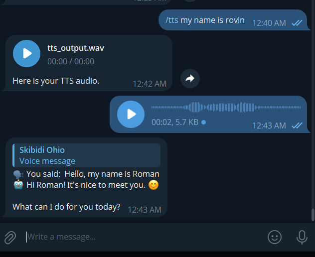
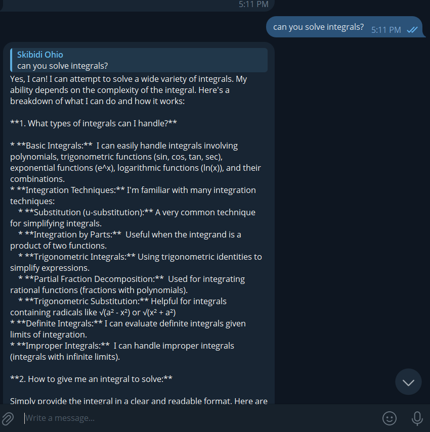
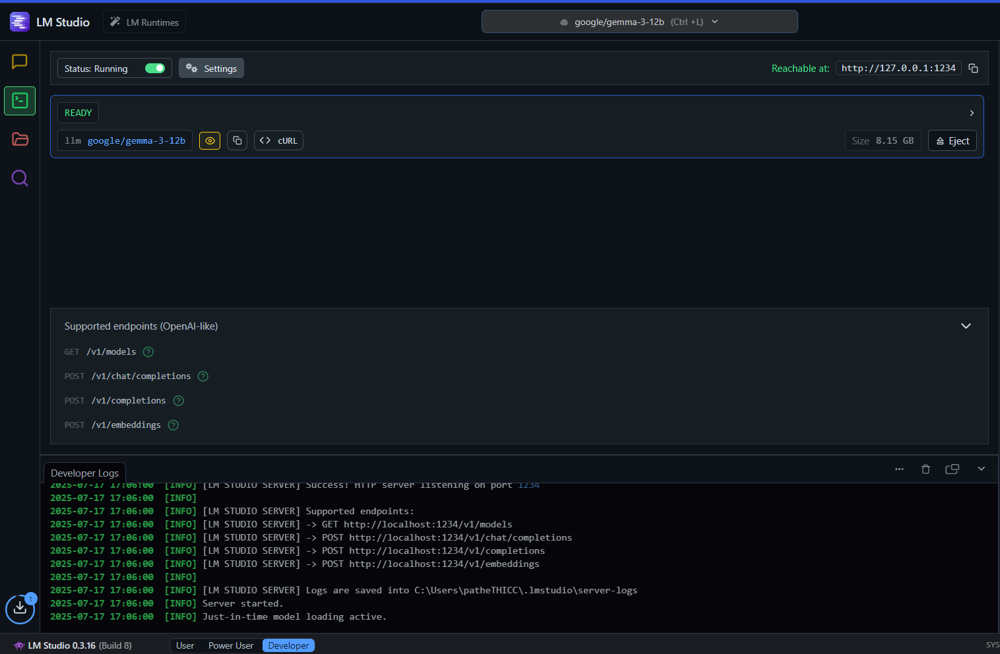

# AI-Powered Telegram Bot

A multi-modal AI Telegram bot that processes all data locally using:
- **Gemma LLM** (via LM Studio) for text generation
- **Whisper STT** for speech-to-text transcription
- **F5-TTS** for text-to-speech synthesis

## Features

- 🤖 Local AI processing (no cloud dependencies)
- 🎤 Voice message transcription
- 🔊 Text-to-speech audio generation
- 💬 Text-based AI conversations
- 🚀 GPU acceleration support

## Setup

1. Install dependencies:
   ```bash
   pip install telebot transformers torch torchvision
   ```

2. Install F5-TTS:
   ```bash
   pip install f5-tts
   ```

3. Set up LM Studio with Gemma model

4. Configure your Telegram bot token

5. Run the bot:
   ```bash
   python import_telebot.py
   ```

## Usage

- `/start` - Initialize the bot
- `/tts <text>` - Generate speech from text
- Send voice messages for transcription
- Send text messages for AI responses

## Technologies Used

- Python, Telegram Bot API
- Gemma LLM, Whisper STT, F5-TTS
- LM Studio, CUDA, ffmpeg

##Images


